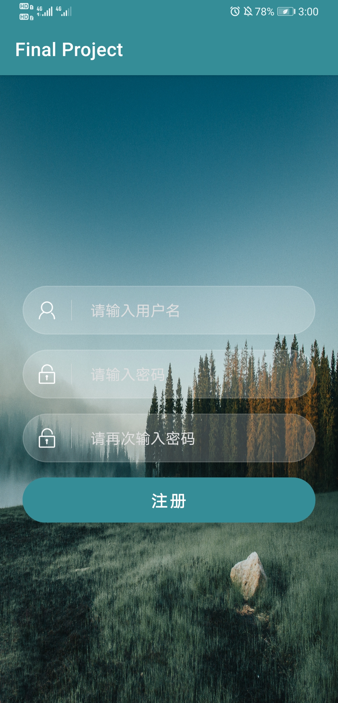
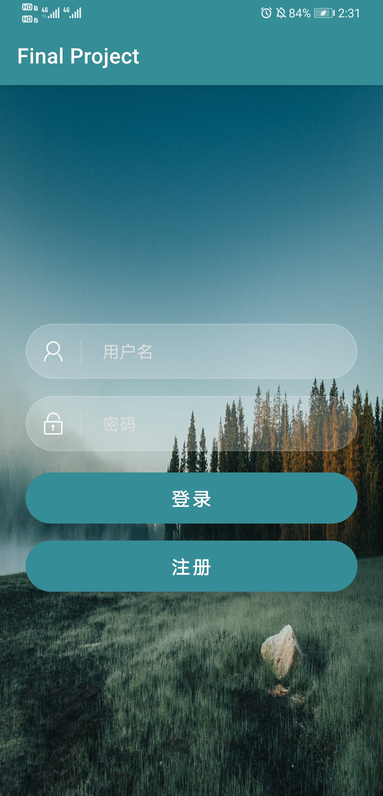
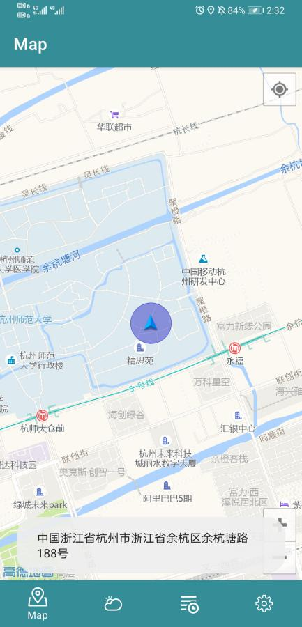
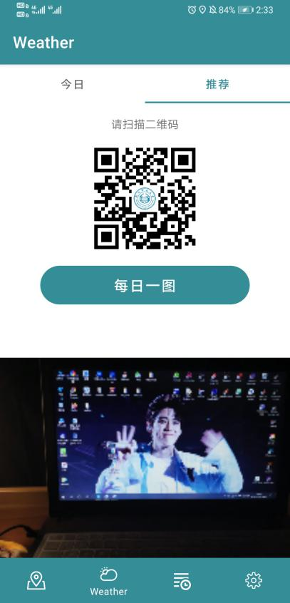
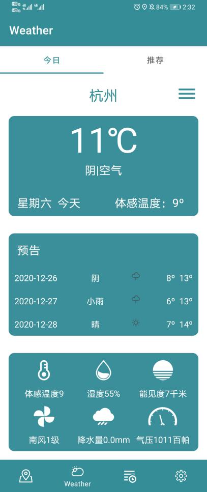
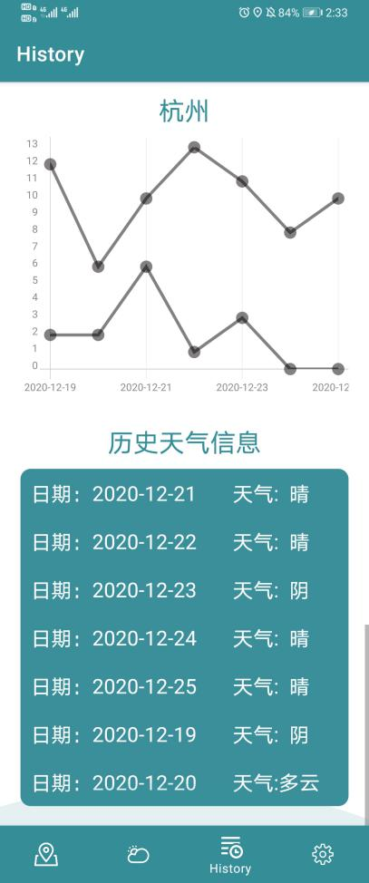
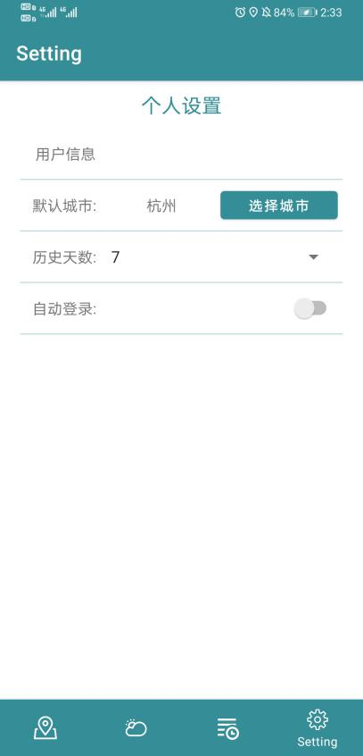

# WeatherForecastAPP-BC-2020
## 系统功能

 
> * 介绍登录/注册页面实现用户的登录与注册
> * 地图模块显示地图并实现定位
> * 天气模块包含今日和推荐两个Tab页面，今日页面是实现对选择城市的天气预报，推荐页面则是现实由学校网址生成的二维码以及调用摄像头拍照并显示
> * 历史模块则是以折线图的方式显示选择城市的历史天气温度变化和用Listview方式展示历史天气
> * 设置模块则是对用户密码的修改、选择要显示历史天气和天气预报的城市、选择显示历史天气的天数以及是否自动登录 
## 系统设计
* 登录/注册页面  
&emsp;&emsp;利用google的room组件实现Sqlite数据库，做一个简单登录、注册页面。注册界面的用户名会对数据库内的数据进行搜索，使其唯一（用户名作为主键），并会对输入的两次密码进行判断；登录界面的用户名和密码进行判断，只有用户名和密码都正确的情况下才能成功登录，跳转至功能界面。 

* 功能模块页面  
&emsp;&emsp;采用fragment布局来实现地图、天气、历史和设置以类似微信的Tab页面方式，显示在页面的底部。其中天气见面fragment内嵌套fragment来实现顶部Tab页面。 

* 地图模块  
&emsp;&emsp;利用高德地图的SDK实现了地图的显示和定位，并在定位失败时予以反馈。 

* 天气模块  
&emsp;&emsp;今日界面采用和风天气SDK、Retrofit+okhttp组件来获取天气信息，Json解析采用gson组件对选择的城市显示实况天气信息、未来三天的天气预报。 
&emsp;&emsp;推荐界面引入zxing.jar包，利用其EncodingUtils工具类来实现二维码的生成，并为其加上logo，而每日一图则是利用系统相机来拍摄任意一张图片，并显示在ImageView控件。 

* 历史模块  
&emsp;&emsp;采用自定义的图表(hellochart组件)的方式显示所选择城市历史天气的气温情况，在ListView中显示填其状况。而数据的存储则是采用google的room组件实现Sqlite数据库，将信息保存至数据库。 

* 设置模块  
&emsp;&emsp;用户信息则是修改密码，首先会验证原来密码的是否正确（通过数据库的数据进行比对），并将新密码更新至数据库； 
&emsp;&emsp;选择天气页面显示的默认城市，改变以后，刷新天气页面的相关信息； 
&emsp;&emsp;选择历史天数后，在历史页面，仅显示有限天数的天气信息。最多可显示过去一周的信息； 
&emsp;&emsp;采用SharedPreference实现是否自动登录，如果是，下次自动登录；反之下次需要输入密码登录。 
## 系统实现
 
 
 
